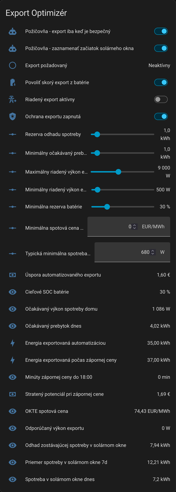
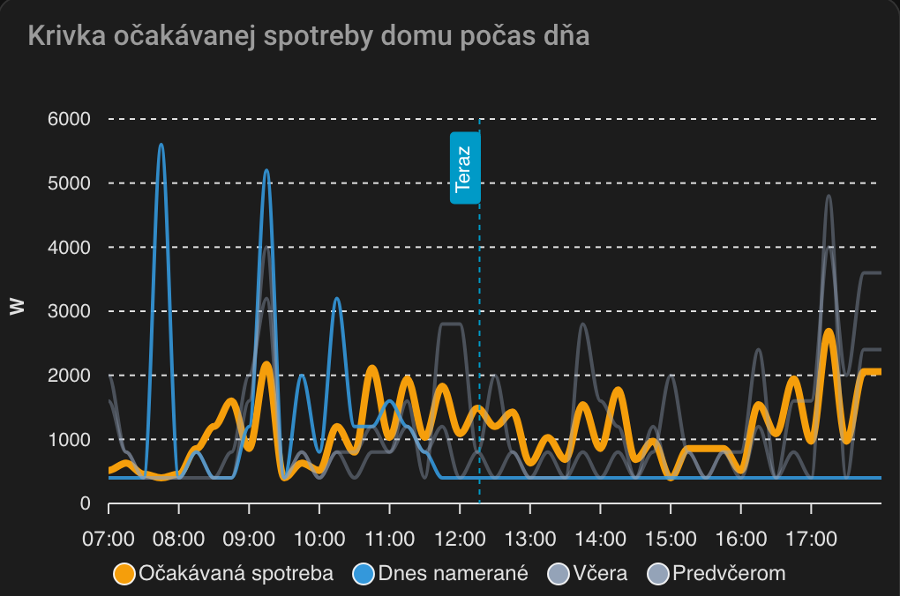

# Home Assistant: ochrana exportu pri záporných spotových cenách

Projekt pre Home Assistant, ktorý pomáha majiteľom fotovoltiky obmedziť zbytočný export elektriny do siete počas záporných spotových cien. Vznikol pre slovenské podmienky, hlavne pre služby typu virtuálna batéria alebo Požičovňa, kde export počas záporných cien nemusí mať hodnotu.

Typický problém: batéria sa počas slnečného dňa nabije doplna, FV systém má prebytok, ale OKTE spotová cena je záporná. Projekt sa snaží vytvoriť miesto v batérii ešte pred záporným cenovým oknom a zároveň pri plnej batérii obmedziť zbytočné krátenie PV výroby.

English version: [README.en.md](README.en.md)

## Odporúčaný spôsob použitia

Odporúčaný spôsob je **custom integrácia** v priečinku [`custom_components/negative_price_export_guard`](custom_components/negative_price_export_guard). Pri prvom nastavení sa vás Home Assistant spýta na konkrétne entity z vašej inštalácie, overí dôležité jednotky a vytvorí ovládacie entity, ktoré sa dajú ladiť priamo z UI.

Alternatívne je k dispozícii aj pôvodný **YAML package** [`Packages/negative_price_export_guard.yaml`](Packages/negative_price_export_guard.yaml). Ten je vhodný pre používateľov, ktorí nechcú custom integráciu alebo chcú vidieť celú logiku priamo v YAML. Pri YAML verzii treba ručne upraviť všetky entity ID v súbore.

## Čo projekt robí

- Počíta aktuálnu OKTE spotovú cenu z atribútu `prices`, nie iba zo stavu senzora.
- Sleduje budúce cenové obdobia pod nastavenou hranicou do konca solárneho okna.
- Učí sa spotrebu domu v solárnom okne z posledných 7 dní.
- Vytvára 15-minútovú krivku očakávanej spotreby domu.
- Používa Solcast dennú predpoveď, detailnú predpoveď a senzor zostávajúcej výroby dnes.
- Počíta očakávaný prebytok po zohľadnení spotreby a voľnej kapacity batérie.
- Prepína menič do `Export First` iba vtedy, keď treba strategicky vytvoriť miesto v batérii.
- Pri vypnutom skorom exporte z batérie obmedzí výkon len na aktuálny PV prebytok.
- Pri plnej batérii vie zvýšiť limit exportu, aby menič zbytočne nekrátil PV výrobu.
- Počíta export počas záporných cien, export automatizáciou, odhad úspory a stratený potenciál.

## Požiadavky

Projekt predpokladá tieto typy integrácií:

- [OKTE DAM](https://github.com/rgildein/okte-home-assistant) alebo podobný zdroj spotových cien s atribútom `prices`.
- [Solcast Solar](https://github.com/BJReplay/ha-solcast-solar) s dennou predpoveďou, atribútom `detailedForecast` a senzorom zostávajúcej výroby dnes.
- [ha-solarman](https://github.com/davidrapan/ha-solarman), Deye alebo iná integrácia meniča, ktorá vie čítať batériu, PV výkon, spotrebu domu a nastavovať režim meniča aj exportný limit.

Najdôležitejšie zdrojové entity sú OKTE ceny, Solcast predpoveď, denná spotreba domu, celkový export do siete, SOC batérie, PV výkon, spotreba domu, režim meniča a číslo pre limit exportu. Presný zoznam je v [Docs/Nastavenie.md](Docs/Nastavenie.md).

## Rýchla inštalácia custom integrácie

Odporúčaná cesta je cez HACS:

1. V HACS otvorte `Integrations -> tri bodky -> Custom repositories`.
2. Do poľa `Repository` vložte `OskarSidor/ha-negative-price-export-guard` alebo `https://github.com/OskarSidor/ha-negative-price-export-guard`.
3. Ako kategóriu vyberte `Integration` a repozitár pridajte.
4. V HACS nainštalujte `Negative Price Export Guard`.
5. Reštartujte Home Assistant.
6. Otvorte `Nastavenia -> Zariadenia a služby -> Pridať integráciu`.
7. Vyhľadajte `Negative Price Export Guard`.
8. Vyberte požadované zdrojové entity v sprievodcovi nastavením.
9. Po vytvorení integrácie skontrolujte entity začínajúce na `export_optimizer_`.
10. Najprv nechajte ochranu vypnutú alebo nastavte nízky maximálny exportný výkon, potom sledujte správanie počas najbližšieho záporného cenového okna.

Alternatíva bez HACS: skopírujte priečinok `custom_components/negative_price_export_guard` do `config/custom_components/negative_price_export_guard` a potom reštartujte Home Assistant.

Podrobný návod pre custom integráciu aj YAML verziu je v [Docs/Nastavenie.md](Docs/Nastavenie.md).

## YAML package

YAML verzia je stále súčasťou repozitára, ale je to manuálna cesta. Po skopírovaní package súboru musíte ručne nahradiť entity ID podľa svojej inštalácie a spustiť kontrolu konfigurácie Home Assistant.

Použite ju hlavne vtedy, ak nechcete custom integráciu alebo si chcete logiku prispôsobiť priamo v YAML.

## Screenshoty

Prehľad entít vytvorených projektom:

Krivka očakávanej spotreby domu:

Ďalšie vhodné screenshoty reálneho výkonu sú denný graf PV výroby, batérie a exportu do siete alebo porovnanie úspory a strateného potenciálu.

## Základné ladiace entity custom integrácie

| Entita | Význam |
|---|---|
| `switch.export_optimizer_guard_enabled` | Hlavné zapnutie alebo vypnutie riadenia exportu |
| `switch.export_optimizer_allow_battery_early_export` | Povolenie skorého exportu z batérie |
| `number.export_optimizer_min_reserve_soc` | Minimálna rezerva batérie |
| `number.export_optimizer_consumption_margin_kwh` | Rezerva odhadu spotreby |
| `number.export_optimizer_typical_idle_power_w` | Minimálna očakávaná spotreba domu vrátane meniča |
| `number.export_optimizer_export_surplus_threshold_kwh` | Minimálny očakávaný prebytok pred zásahom |
| `number.export_optimizer_min_export_power_w` | Spodný limit exportu pri použití batérie |
| `number.export_optimizer_max_export_power_w` | Horný limit riadeného exportu |
| `number.export_optimizer_price_floor` | Cenová hranica, pod ktorou sa export považuje za nežiaduci |

## Bezpečnostné poznámky

- Najprv testujte s nízkym maximálnym exportným výkonom.
- Overte, že váš menič používa režimy `Export First` a `Zero Export To CT` tak, ako očakávate.
- Skontrolujte, či zmena exportného limitu nemá vedľajšie účinky aj v iných režimoch meniča.
- Projekt nie je finančné, právne ani elektrotechnické odporúčanie.
- Používate ho na vlastnú zodpovednosť.
